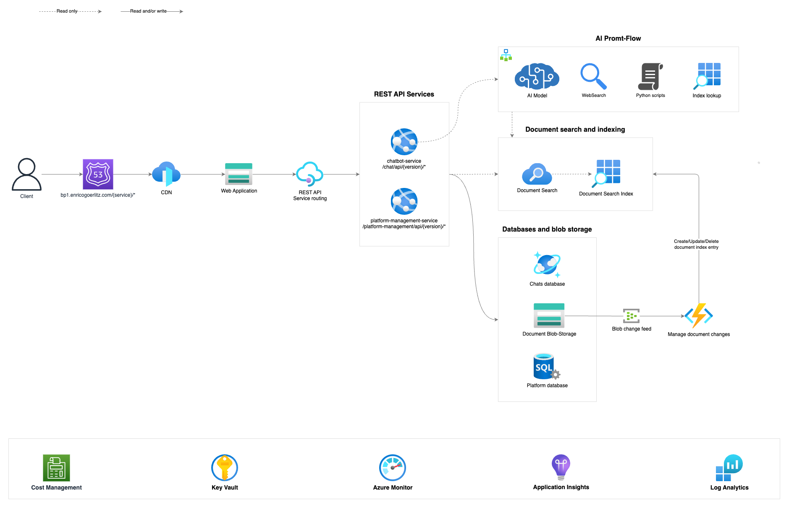

# 🎓 Project: emtec-ai-devicetype-agent

## Project Architecture

### High Level Project Overview

### API

- SERP API => WebSearch

## Chatbot

## Further improvements

- use the database data of the devices (by type code) in each prompt to achieve context in the selected devices (by type code)
- each web search query should be in german (maybe; or use user message language?)
- implement validations ^^

